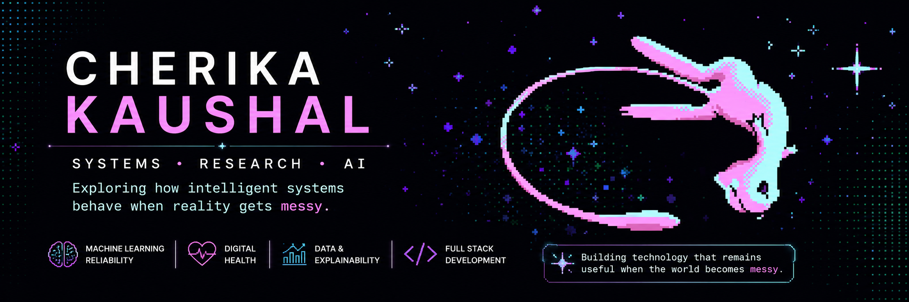

# CHERIKA KAUSHAL

### Research · Systems · Software

CSE undergraduate exploring machine learning, reliable systems, digital health, and research software.

 

  

---

## ABOUT

🎓 CSE undergraduate at **Punjabi University, Patiala**  
🔬 Research experience at **IIT Ropar**  
💻 Software development experience in startup environments  
🧠 Interested in **ML reliability, Explainable AI, digital health & research software**  
🏆 National-level Gold Medalist · 🎯 150+ LeetCode problems

---

## FOCUS

<table>
<tr>
<td width="50%">

### MACHINE LEARNING

Reliability · Robustness · Explainable AI · Data Quality

</td>
<td width="50%">

### RESEARCH SOFTWARE

Research Applications · Data Systems · Experimental Tools

</td>
</tr>

<tr>
<td width="50%">

### SOFTWARE ENGINEERING

Full-Stack Systems · APIs · Databases · Production Web

</td>
<td width="50%">

### DIGITAL HEALTH

Longitudinal Data · Wearables · Research Platforms

</td>
</tr>
</table>

---

## TECHNICAL STACK

---

## GITHUB ACTIVITY

---

## BEYOND CODE

🎨 Painting &nbsp; · &nbsp;
✈️ Travel &nbsp; · &nbsp;
♟️ Chess &nbsp; · &nbsp;
🎵 Music &nbsp; · &nbsp;
✍️ Writing &nbsp; · &nbsp;
🌸 Flowers

---

### BUILDING · LEARNING · EXPLORING

 

<a href="https://cherikakaushal.github.io">PORTFOLIO</a>
&nbsp; · &nbsp;
<a href="https://www.linkedin.com/in/cherika-kaushal-4b9b8b30b">LINKEDIN</a>
&nbsp; · &nbsp;
<a href="mailto:cherikakaushal@gmail.com">EMAIL</a>

  

